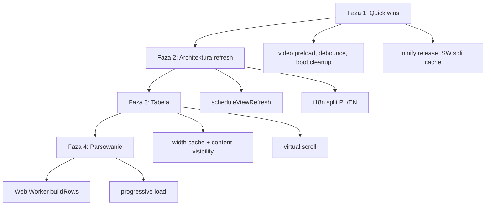

# Plan optymalizacji performance — czerwiec 2026

> **Status: W TRAKCIE** — Faza 1 domknięta (#7–#8). Faza 2 częściowo wdrożona (scheduleViewRefresh, lazy analysis-heavy).

## Zasady

- Małe kroki, każdy większy etap = osobny commit (punkt powrotu).
- **Bez regresji** — nie psujemy celowo, żeby „potem naprawić lepiej”.
- Quick wins ≠ eksperymenty architektoniczne (virtual scroll, Worker) — to osobne fazy po akceptacji.
- Mierzymy przed/po: boot (TTI), wczytanie arkusza, latencja „Filtruj”, pamięć przy stress-teście.

## Co już działa (nie ruszać bez powodu)

| Obszar | Stan |
|--------|------|
| XLSX + JSZip | Leniwie (`ensureXlsxLibs`) |
| `scroll-diagnostics.js` | Tylko z `?scrolltest` |
| Analizy sidebara | `deferAnalysis` + idle prewarm; ciężkie panele bez prewarm w tle |
| Tabela | Limit `maxRows`, `DocumentFragment`, próbka 300 wierszy w szerokościach |
| Animacje sort/filtr | FLIP z pasmem viewportu + cap CPU/RAM |
| CF | Cache `cfEvalCache` |
| PWA | SW, sidebar prewarm w idle |

## Profil rozmiaru (nieskompresowany, orientacyjnie)

| Asset | ~KB | Ładowanie |
|-------|-----|-----------|
| `lib/xlsx-js-style.bundle.min.js` | 425 | Leniwie |
| `app/analysis.js` | 160 | Eager |
| `app/ui-controls.js` | 126 | Eager |
| `styles/app.css` | 120 | Eager |
| `app/language.js` | 101 | Eager (PL+EN) |
| `index.html` | 91 | Eager |
| `mateusz-intro.mp4` | 496 | Video (preload) |

Eager JS przy starcie: ~750 KB (bez XLSX). Brak bundlera/minify w repo.

---

## Kolejność wdrożenia (propozycja)

### Faza 1 — Quick wins (niskie ryzyko) — **zamknięta** (poza #9 odłożonym)

| # | Zmiana | Efekt | Status |
|---|--------|-------|--------|
| 1 | `preload="metadata"` na intro video | Mniej konkurencji o bandwidth przy starcie | **Wdrożone** (2026-06-29) |
| 2 | Debounce 200 ms na `rowHeightAll` / `colWidthAll` | Mniej pełnych re-renderów przy wpisywaniu | **Wdrożone** |
| 3 | Delegacja `click` na `thead` (sort nagłówków) | Mniej listenerów przy każdym renderze | **Wdrożone** |
| 4 | Cache `computeColumnWidths` (bezpieczny klucz) | Szybszy re-render gdy zmienia się tylko wysokość wierszy itp. | **Wdrożone** |
| 5 | Pominąć render analiz na boot bez arkusza | Lżejszy start | **Wdrożone** |
| 6 | `content-visibility` na panelach sidebara | Płynniejszy scroll sidebara | **Wdrożone** |
| 7 | Minifikacja CSS/JS w release (`esbuild`) | −20–35% transferu | **Wdrożone** (`npm run build` → `dist/`) |
| 8 | Leniwy `cursor-hint.js` | −29 KB parse przy starcie | **Wdrożone** (idle + pierwsza interakcja z `data-hint`) |
| 9 | SW: shell vs heavy cache (XLSX, video osobno) | Lżejsza pierwsza instalacja PWA | **Odłożone** (decyzja: tylko pierwsza instalacja) |

### Faza 2 — Architektura refresh (średnie ryzyko) — **częściowo wdrożone**

- ✅ `scheduleViewRefresh({ table, analyses, formula })` — coalescing kaskad renderów (rAF; `sync: true` w `withSceneTransition`).
- ✅ Leniwy `analysis-heavy.js` (~45 KB) — render duration + aggregation przy pierwszym użyciu panelu (logika agregacji współdzielona z tabelą/monthly zostaje w `analysis.js`).
- ⏸ Split `language.js` → dynamiczny import locale — **odłożone do akceptacji**.

**Pozostało z Fazy 2:** split i18n (gdy zaakceptujesz).

### Faza 3 — Tabela (wyższy nakład, duży zysk)

- Pełny rebuild DOM przy każdym filtrze/sorcie — główne wąskie gardło runtime.
- `content-visibility: auto` na `<tr>` poza viewportem (etap pośredni).
- **Virtual scroll** — render tylko widocznych wierszy + spacer.

**Szacowany czas:** ~1 tydzień. **Wymaga akceptacji + testów Playwright/stress.**

### Faza 4 — Parsowanie (największy zysk na dużych plikach)

- `buildRows()` synchronicznie na main thread — blokuje UI przy dużych arkuszach.
- Web Worker + opcjonalny progressive load (chunki + progress bar).
- Tryb „szybki podgląd” bez pełnych stylów przy pierwszym wczytaniu.

**Szacowany czas:** 1–2 tygodnie. **Wymaga akceptacji.**

---

## Krytyczne wąskie gardła (kontekst audytu)

1. **Render tabeli** — `replaceChildren()` + inline style per komórka (`applyCellStyle`).
2. **Parsowanie** — `buildRows` O(wiersze × kolumny) na main thread; `maxRows` chroni tylko widok.
3. **Kaskada renderów** — po „Filtruj” wiele `render*()` (łagodzone przez `deferAnalysis` + `scheduleViewRefresh`).
4. **Rozmiar bootu** — monolity JS, oba języki, brak minify, video `preload="auto"`.

## Metryki do śledzenia

1. TTI / boot do interaktywnego empty state.
2. Czas `buildRows` + pierwszy `renderTable` (stress-test).
3. Latencja klik „Filtruj” → paint (Performance panel).
4. Heap po 10k × 30 komórek.
5. CLS (utrzymać < 0,1).

Istniejące narzędzia: `scripts/save-stress-playwright.js`, `scripts/gen-stress-test.js`, `npm test`.

## Odrzucone / odłożone na później

- `ios-momentum.js` — wcześniejsza próba naprawy (nie wyszła); **nie podłączać** bez nowych dowodów. Zostaje `scroll-diagnostics.js` + `ipad-scroll-debug.js` (`?scrolldebug`).
- Zamiana inline stylów na klasy CSS — duży refactor, Faza 3+.
- Szablony paneli z JS zamiast 91 KB HTML — duży refactor UX/DOM.

---

*Ostatnia aktualizacja planu: 2026-06-29 (build 20260629-08).*
