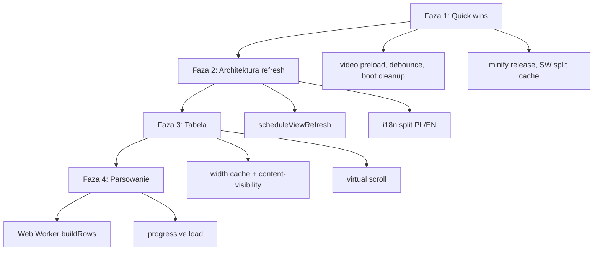

# Plan optymalizacji performance — czerwiec 2026

> **Status: BACKLOG NIEPIORYTETOWY** — Faza 1 zamknięta (#7–#8). Faza 2 wdrożona w zakresie refresh + lazy analysis-heavy. **Fazy 3–4 i i18n split — nie priorytet** (decyzja 2026-06-29, patrz niżej).

## Zasady

- Małe kroki, każdy większy etap = osobny commit (punkt powrotu).
- **Bez regresji** — nie psujemy celowo, żeby „potem naprawić lepiej”.
- Quick wins ≠ eksperymenty architektoniczne (virtual scroll, Worker) — to osobne fazy po akceptacji.
- Mierzymy przed/po: boot (TTI), wczytanie arkusza, latencja „Filtruj”, pamięć przy stress-teście.

## Co już działa (nie ruszać bez powodu)

| Obszar | Stan |
|--------|------|
| XLSX + JSZip | Leniwie (`ensureXlsxLibs`) |
| `scroll-diagnostics.js` | Tylko z `?scrolltest` |
| Analizy sidebara | `deferAnalysis` + idle prewarm; ciężkie panele bez prewarm w tle |
| Tabela | Limit `maxRows`, `DocumentFragment`, próbka 300 wierszy w szerokościach |
| Animacje sort/filtr | FLIP z pasmem viewportu + cap CPU/RAM |
| CF | Cache `cfEvalCache` |
| PWA | SW, sidebar prewarm w idle |

## Profil rozmiaru (nieskompresowany, orientacyjnie)

| Asset | ~KB | Ładowanie |
|-------|-----|-----------|
| `lib/xlsx-js-style.bundle.min.js` | 425 | Leniwie |
| `app/analysis.js` | ~117 (+ ~45 lazy) | Eager (+ `analysis-heavy.js` leniwie) |
| `app/ui-controls.js` | 126 | Eager |
| `styles/app.css` | 120 | Eager |
| `app/language.js` | 101 | Eager (PL+EN) |
| `index.html` | 91 | Eager |
| `mateusz-intro.mp4` | 496 | Video (preload) |

Eager JS przy starcie: ~750 KB (bez XLSX). Release: `npm run build` → minifikowany `dist/` (~−39% transferu).

---

## Kolejność wdrożenia (propozycja)

### Faza 1 — Quick wins (niskie ryzyko) — **zamknięta** (poza #9 odłożonym)

| # | Zmiana | Efekt | Status |
|---|--------|-------|--------|
| 1 | `preload="metadata"` na intro video | Mniej konkurencji o bandwidth przy starcie | **Wdrożone** (2026-06-29) |
| 2 | Debounce 200 ms na `rowHeightAll` / `colWidthAll` | Mniej pełnych re-renderów przy wpisywaniu | **Wdrożone** |
| 3 | Delegacja `click` na `thead` (sort nagłówków) | Mniej listenerów przy każdym renderze | **Wdrożone** |
| 4 | Cache `computeColumnWidths` (bezpieczny klucz) | Szybszy re-render gdy zmienia się tylko wysokość wierszy itp. | **Wdrożone** |
| 5 | Pominąć render analiz na boot bez arkusza | Lżejszy start | **Wdrożone** |
| 6 | `content-visibility` na panelach sidebara | Płynniejszy scroll sidebara | **Wdrożone** |
| 7 | Minifikacja CSS/JS w release (`esbuild`) | −20–35% transferu | **Wdrożone** (`npm run build` → `dist/`) |
| 8 | Leniwy `cursor-hint.js` | −29 KB parse przy starcie | **Wdrożone** (idle + pierwsza interakcja z `data-hint`) |
| 9 | SW: shell vs heavy cache (XLSX, video osobno) | Lżejsza pierwsza instalacja PWA | **Odłożone** (decyzja: tylko pierwsza instalacja) |

### Faza 2 — Architektura refresh — **zamknięta w obecnym zakresie**

- ✅ `scheduleViewRefresh({ table, analyses, formula })` — coalescing kaskad renderów (rAF; `sync: true` w `withSceneTransition`).
- ✅ Leniwy `analysis-heavy.js` (~45 KB) — render duration + aggregation przy pierwszym użyciu panelu (logika agregacji współdzielona z tabelą/monthly zostaje w `analysis.js`).
- ⏸ Split `language.js` → dynamiczny import locale — **nie priorytet** (decyzja 2026-06-29).

### Faza 3 — Tabela — **nie priorytet** (decyzja 2026-06-29)

- Pełny rebuild DOM przy każdym filtrze/sorcie — wąskie gardło runtime przy **dużym** `maxRows`, nie przy samym scrollu.
- `content-visibility: auto` na `<tr>` — etap pośredni, umiarkowany zysk.
- **Virtual scroll** — duży zysk tylko przy bardzo dużych widokach; ryzyko regresji FLIP/focus/fling na iPadzie.

**Wrócić do rozważenia gdy:** odczuwalny lag po „Filtruj”/sort na dużym arkuszu (stress-test / realne pliki). Fix scrolla iPada (2026-06) **nie zastępuje** tej fazy — to osobna warstwa (render vs natywne przewijanie).

**Szacowany czas:** ~1 tydzień. Wymaga testów Playwright/stress.

### Faza 4 — Parsowanie — **nie priorytet** (decyzja 2026-06-29)

- `buildRows()` synchronicznie na main thread — blokuje UI przy **bardzo dużych** arkuszach (10k+ wierszy).
- Web Worker + opcjonalny progressive load (chunki + progress bar).
- Tryb „szybki podgląd” bez pełnych stylów przy pierwszym wczytaniu.

**Wrócić do rozważenia gdy:** regularnie wczytujesz duże pliki i boot/wczytanie jest realnym bólem. Przy typowych arkuszach (<3k wierszy) ROI słabe vs nakład (Worker, serializacja, dwa ścieżki testów).

**Szacowany czas:** 1–2 tygodnie.

---

## Decyzje produktowe (2026-06-29)

| Temat | Werdykt | Uzasadnienie (skrót) |
|--------|---------|----------------------|
| **Faza 3 — tabela / virtual scroll** | Nie priorytet | Scroll na iPadzie OK po fixie; Faza 3 dotyczy kosztu renderu przy filtrze/sorcie, nie przewijania. |
| **Faza 4 — Worker `buildRows`** | Nie priorytet | Duży refactor; sens tylko przy codziennym wczytywaniu bardzo dużych plików. |
| **i18n split (`language.js`)** | Nie priorytet | ~50 KB parse mniej, ale już zrobiono hint + analysis-heavy + minify; koszt utrzymania/async i18n. |
| **#9 SW split cache** | Odłożone wcześniej | Dotyczy głównie pierwszej instalacji PWA, nie runtime po cache. |

**Priorytet na teraz:** utrzymanie obecnych optymalizacji, obserwacja metryk; bez nowych faz architektonicznych bez konkretnego triggera (lag filtra, duże pliki, wolny boot po pomiarach).

---

## Krytyczne wąskie gardła (kontekst audytu)

1. **Render tabeli** — `replaceChildren()` + inline style per komórka (`applyCellStyle`).
2. **Parsowanie** — `buildRows` O(wiersze × kolumny) na main thread; `maxRows` chroni tylko widok.
3. **Kaskada renderów** — po „Filtruj” wiele `render*()` (łagodzone przez `deferAnalysis` + `scheduleViewRefresh`).
4. **Rozmiar bootu** — częściowo łagodzone (lazy hint, analysis-heavy, minify w `dist/`); pełny i18n split nadal opcjonalny.

## Metryki do śledzenia

1. TTI / boot do interaktywnego empty state.
2. Czas `buildRows` + pierwszy `renderTable` (stress-test).
3. Latencja klik „Filtruj” → paint (Performance panel).
4. Heap po 10k × 30 komórek.
5. CLS (utrzymać < 0,1).

Istniejące narzędzia: `scripts/save-stress-playwright.js`, `scripts/gen-stress-test.js`, `npm test`.

## Odrzucone / odłożone na później

- **Faza 3 (virtual scroll, `content-visibility` na `<tr>`)** — nie priorytet; trigger: lag filtra/sortu na dużym widoku.
- **Faza 4 (Web Worker `buildRows`, progressive load)** — nie priorytet; trigger: codzienne bardzo duże pliki.
- **i18n split (`language.js`)** — nie priorytet; trigger: wolny boot po pomiarach mimo obecnych optymalizacji.
- `ios-momentum.js` — wcześniejsza próba naprawy (nie wyszła); **nie podłączać** bez nowych dowodów. Zostaje `scroll-diagnostics.js` + `ipad-scroll-debug.js` (`?scrolldebug`).
- Zamiana inline stylów na klasy CSS — duży refactor, ewentualnie przy Fazie 3.
- Szablony paneli z JS zamiast 91 KB HTML — duży refactor UX/DOM.

---

*Ostatnia aktualizacja planu: 2026-06-29 (decyzje backlogu: Fazy 3–4 + i18n nie priorytet).*
